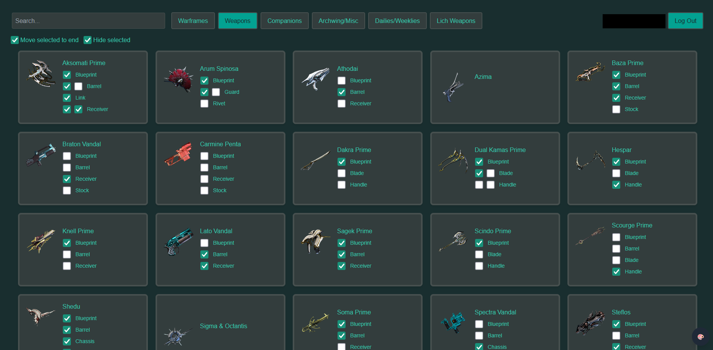
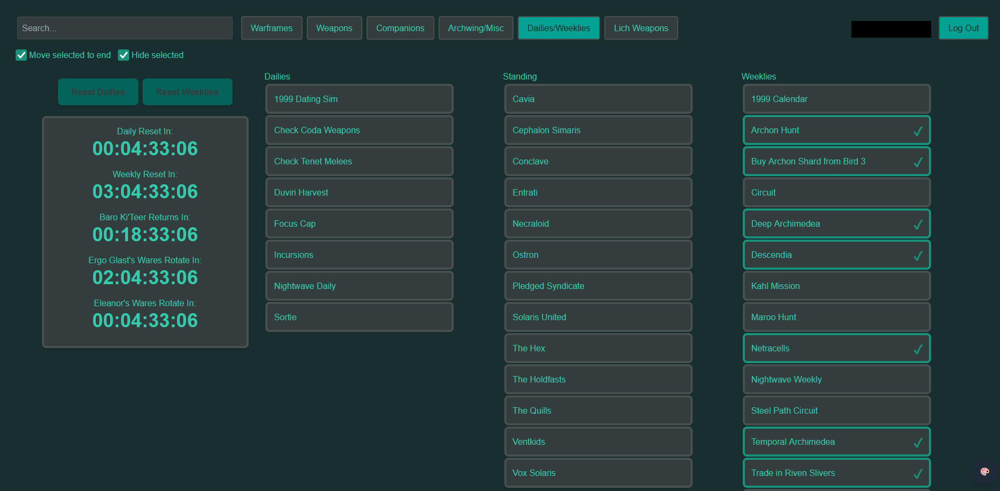
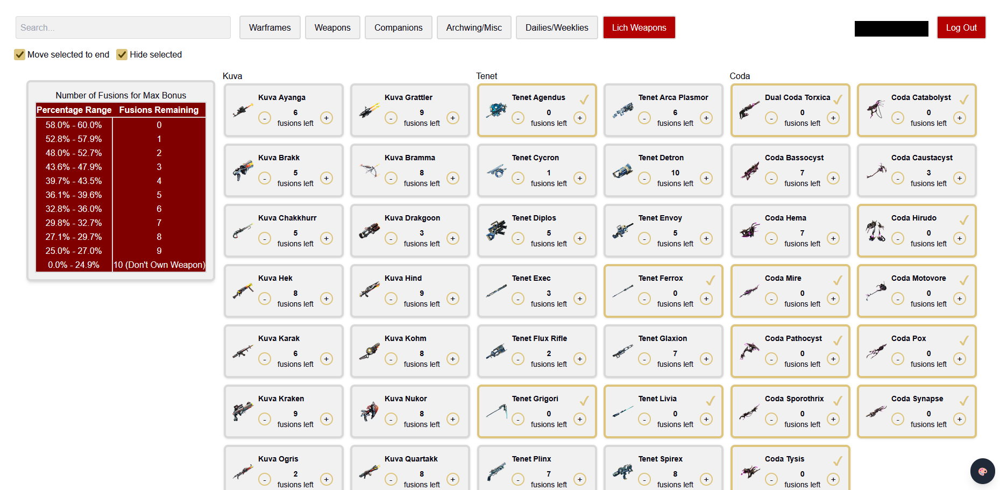

# Warframe Checklist
A full stack web application for manually tracking various things in Warframe.

## Features
Can be currently can be used to track:
- Masterable Warframe, primary, secondary, melee, companion, companion weapon, archwing, archgun, archmelee, amp, and K-drive ownership
- Part ownership for the above that have more than one part
- Daily and weekly reset timers as well as rotation timers for buyable Tenet and Coda weapon offerings and Baro Ki'Teer appearances
- Completion of daily standing caps and daily and weekly activities
- Progenitor bonus tracking for all Lich weapons

Other features include
- Authenticated account system
- Convenient links to the official Warframe wiki
- Ability to filter out owned items
- Theme system with multiple Warframe inspired color themes

## Motivation
I built this to solve a personal issue I had while grinding mastery level. While you can see what you have mastered in the in-game codex, it's really annoying to actually figure out what parts you need for everything that you don't have mastered in-game. You end up going through a ton of menus to check if you own a part, then repeat the process for each item. I eventually found myself keeping a notepad with things like the weapons I needed from Prime Resurgences and the percentages all of my Lich weapons were at. This was more convenient, but still annoying, so I searched for a solution.

Other tracking sites existed, but didn't have the granularity I wanted (the ability to track individual item parts/blueprints). AlecaFrame does track owned items, but I didn't want to use it due to Digital Extremes' stance on third party addons. Thus, I ended up creating this site for myself, tailored to exactly what I was looking for in a tracker.
## Screenshots
**Weapons tab with Void theme**

**Activities tab with Void theme**

**Lich weapons tab with Classic Theme**

## How to Use
The application is available to use at: https://warframechecklist.netlify.app/

To use the site, create an account and verify your email (verification email may go to your spam folder). Then you will be able to log in and begin tracking your items. Currently there is no plan to add guest accounts or tracking in browser.

## Tech Stack
**Frontend**
- React
- Gatsby
- Tailwind CSS

**Backend**
- Node.js

**Database**
- PostgreSQL

**Dev Tools and APIs**
- Docker
- Git
- npm
- @wfcd/items

## Design Highlights
- Reusable React components with custom hooks
- Database schemas designed for data integrity and efficient queries
- Containerized setup for consistent development environments

## Potential Future Improvements
Overall I am pretty happy with the current state of the site, so I am not planning further development outside of just maintaining the current functionality. These are just some improvements that wouldn't be useful to me but may be useful to others using the site:
- Guest accounts/tracking using browser LocalStorage
- Tracking for everything that gives mastery. This would entail adding tracking for completed mission nodes, Railjack and Drifter intrinsics, and potentially overlevelling on Necramechs, Lich weapons, and the Paracesis
- If Digital Extremes releases an official API that gave account information, I would add integration with it 
- Integration with the official World State API
- Tracking of parts past the ones needed for mastery, particularly Prime parts for relic farmers
- Tracking of unmasterable but earnable items, such as Lich ephemeras
- Adding missing items to tracking; AFAIK this is only the Sirocco and founders' items. I tried to add the Sirocco but I have no idea where the data is in the API because it isn't with the other amps

## Skills Demonstrated
- Full-stack web development
- Relational database modeling
- State management in React
- Containerized development